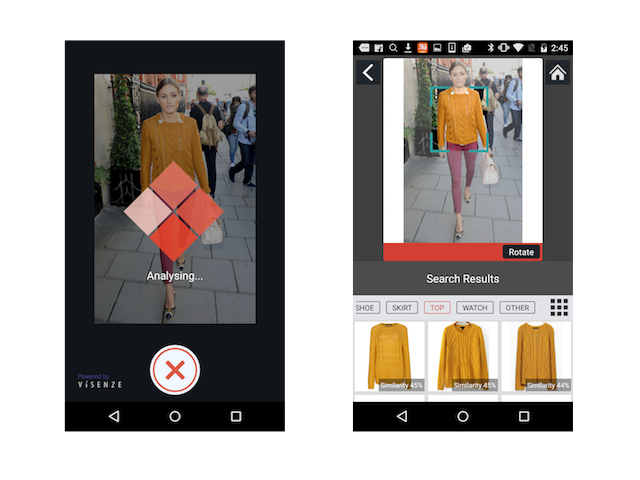

# ViSearch Android SDK and Demo Source Code
[](https://travis-ci.org/visenze/visearch-sdk-android)

---

## Table of Contents
 1. [Overview](#1-overview)
      - 1.1 [About ViSearch Android SDK](#11-about-visearch-android-sdk)
 2. [Setup](#2-setup)
      - 2.1 [Run the Demo](#21-run-the-demo)
      - 2.2 [Install the SDK](#22-install-the-sdk)
      - 2.3 [Add User Permissions](#23-add-user-permissions)
 3. [Initialization](#3-initialization)
      - 3.1 [ViSearch API](#31-visearch-api)
      - 3.2 [ProductSearch API](#32-productsearch-api)
 4. [Solution APIs](#4-solution-apis)
      - 4.1 [ViSearch](#41-visearch)
          - 4.1.1 [Visually Similar Recommendations](#411-visually-similar-recommendations)
          - 4.1.2 [Search by Image](#412-search-by-image)
            - 4.1.2.1 [Selection Box](#4121-selection-box)
            - 4.1.2.2 [Resizing Settings](#4122-resizing-settings)
          - 4.1.3 [Search by Color](#413-search-by-color)
          - 4.1.4 [Multiple Products Search](#414-multiple-products-search)
	  - 4.2 [ProductSearch](#42-productsearch)
 5. [Search Results](#5-search-results)
      - 5.1 [ViSearch Response](#51-visearch-response)
      - 5.2 [ProductSearch Response](#52-productsearch-response)
 6. [Advanced Search Parameters](#6-advanced-search-parameters)
	  - 6.1 [Retrieving Metadata](#61-retrieving-metadata)
	  - 6.2 [Filtering Results](#62-filtering-results)
	  - 6.3 [Result Score](#63-result-score)
      - 6.4 [Automatic Object Recognition Beta](#64-automatic-object-recognition-beta)
 7. [Event Tracking](#7-event-tracking)
      - 7.1 [Setup Tracking](#71-setup-tracking)
      - 7.2 [Send Events](#72-send-events)
      
---


## 1. Overview

### 1.1 About ViSearch Android SDK
ViSearch is an API that provides accurate, reliable and scalable image search. ViSearch API provides two services ( Data API and Search API) to let the developers prepare image database and perform image searches efficiently. ViSearch API can be easily integrated into your web and mobile applications. For more details, see [ViSearch API Documentation](http://www.visenze.com/docs/overview/introduction).

The ViSearch Android SDK is an open source software to provide easy integration of ViSearch Search API with your Android mobile applications. It provides three search methods based on the ViSearch Search API - pre-indexed search, color search and upload search. For source code and references, please visit the [Github Repository](https://github.com/visenze/visearch-sdk-android).

>Current stable version: 1.5.0

>Minimum Android SDK Version: API 9, Android 2.3


## 2. Setup

### 2.1 Run the Demo
The source code of a demo application is provided together with the SDK ([demo](https://github.com/visenze/visearch-sdk-android/tree/master/cameraDemo)). You can simply open **visearch-sdk-android** project in Android Studio and run the **cameraDemo** project. 


You should change the app key  your own app key before running. You can create and manage

```java
public class MainActivity extends FragmentActivity {
    //TODO: init app key here
    private static final String appKey = "YOUR_APP_KEY ";
    private static final Integer placementId = 1; // used only with the ProductSearch API

    @Override
    public void onCreate(Bundle savedInstanceState) {
    
    ...
```

You can play around with our demo app to see how we build up the cool image search feature using ViSearch SDK.




### 2.2 Install the SDK
You can include the dependency in your project using gradle:

```
implementation 'com.visenze:visearch-android:1.5.0'
```

In the `build.gradle` file under your app module, add the packaging options to ensure a successful compilation:

```
android {
	...
	
    packagingOptions {
        exclude 'META-INF/NOTICE'
        exclude 'META-INF/LICENSE'
    }
    ...
}
```

If you want to use the packaged Jars directly in your project, please find all the dependencies in the directory `/dependency`

### 2.3 Add User Permissions
ViSearch Android SDK needs these user permissions to work. Add the following declarations to the `AndroidManifest.xml` file.  Network permission allows the app to connect to network services. Write/read to external storage permissions allow the app to load and save images on the device.

```xml
<?xml version="1.0" encoding="utf-8"?>
<manifest xmlns:android="http://schemas.android.com/apk/res/android"
    package="com.visenze.android.visenze_demo_test">

	<uses-permission android:name="android.permission.CAMERA"/>
	<uses-permission android:name="android.permission.INTERNET"/>
	<uses-permission android:name="android.permission.WRITE_EXTERNAL_STORAGE"/>

	<application>
	...
	</application>
</manifest>
```

## 3. Initialization

### 3.1 ViSearch API

`ViSearch` must be initialized with an app key before it can be used. In order for it to be notified of the search result, `ViSearch.ResultListener` must be implemented. Call `viSearch.setListener` to set the listener.

```java

public class MyActivity extends Activity implements ViSearch.ResultListener{
    //Please change to your app key
    private static final String APP_KEY = "your_app_key";
	...

    @Override
    protected void onCreate(Bundle savedInstanceState) {
        super.onCreate(savedInstanceState);

		ViSearch viSearch = new ViSearch.Builder(APP_KEY).build(context);
		viSearch.setListener(this);

		...
	}
	...
}
```

Please init ViSearch client in this way if you connect to another endpoint rather than default (https://visearch.visenze.com)

```java
ViSearch viSearch = new ViSearch
                .Builder(APP_KEY)
                .setApiEndPoint("https://custom-visearch.yourdomain.com")
                .build(context);
```                

To set a custom device ID for Analytics, you can init the SDK in this way:

```java
ViSearch viSearch = new ViSearch.Builder(APP_KEY).setUid("your device id such as random UUID").build(context);

// custom tracker for Analytics
// Tracking code can be viewed in ViSenze's dashboard
Tracker tracker = viSearch.newTracker(code, false);
```

### 3.2 ProductSearch API

`ProductSearch` must be initialized with an app key and a placement id before it can be used. In order for it to be notified of the search result, `ProductSearch.ResultListener` callback must be provided when making the actual API call.

```java
public class MyActivity extends Activity {
    private static final String appKey = "YOUR_APP_KEY";
    private static final Integer placementId = 1; 
	...
    @Override
    protected void onCreate(Bundle savedInstanceState) {
        SearchAPI.initProductSearchAPI(this, appKey, placementId);
		...
	}
	...
}
```

Please init ProductSearch client with the following if there is a need for changing the default endpoint (https://search.visenze.com).

```java
ProductSearch productSearch = new ProductSearch
                            .Builder(appKey, placementId)
                            .setApiEndPoint("https://custom-visearch.yourdomain.com")
                            .build(context);
```                

## 4. Solution APIs

### 4.1 ViSearch

#### 4.1.1 Visually Similar Recommendations

GET /search

**Visually Similar Recommendations** solution is to search for visually similar images in the image database giving an indexed image’s unique identifier (im_name).

```java
IdSearchParams idSearchParams = new IdSearchParams("dress_1");
viSearch.idSearch(idSearchParams);
```

#### 4.1.2 Search by Image

POST /uploadsearch

**Search by image** solution is to search similar images by uploading an image or providing an image url. Image class is used to perform the image encoding and resizing. You should construct the Image object and pass it to uploadsearch to start a search.

* Using an image from a local file path:

```java
Image image = new Image("/local/path/to/image.jpg");
UploadSearchParams uploadSearchParams.setImage(image);

viSearch.uploadSearch(uploadSearchParams);
```

* Using an image by providing the Uri of the image in photo gallery:

```java
Image image = new Image(context, uri);
UploadSearchParams uploadSearchParams = new UploadSearchParams(image);

viSearcher.uploadSearch(uploadSearchParams);
```

* Construct the `image` from the byte array returned by the camera preview callback:

```java
@Override
public void onPictureTaken(byte[] bytes, Camera camera) {
    Image image = new Image(bytes);
    UploadSearchParams uploadSearchParams = new UploadSearchParams(image);
    
    viSearcher.uploadSearch(uploadSearchParams);
}
```

* Alternatively, you can pass an image url directly to `uploadSearchParams` to start the search :

```java
String url = "http://mydomain.com/sample_image.jpg";
UploadSearchParams uploadSearchParams = new UploadSearchParams(url);
viSearcher.uploadSearch(uploadSearchParams);
```

* If you are performing refinement on an uploaded image, you can pass the im_id returned in the search result to start the search instead of uploading the image again:

```
String imId;

@Override
public void onSearchResult(ResultList resultList) {
    imId = resultList.getImId();
	for (ImageResult imageResult : resultList.getImageList()) {
		//Do something with the result
		...
	}
}

UploadSearchParams uploadSearchParams = new UploadSearchParams();
uploadSearchParams.setImId(imId);
viSearcher.uploadSearch(uploadSearchParams);
```

##### 4.1.2.1 Selection Box
If the object you wish to search for takes up only a small portion of your image, or other irrelevant objects exists in the same image, chances are the search result could become inaccurate. Use the Box parameter to refine the search area of the image to improve accuracy. The box coordinated is set with respect to the original size of the uploading image:

```java
Image image = new Image(this, uri);
// create the box to refine the area on the searching image
// Box(x1, y1, x2, y2) where (0,0) is the top-left corner
// of the image, (x1, y1) is the top-left corner of the box,
// and (x2, y2) is the bottom-right corner of the box.
image.setBox(0, 0, 400, 400);
```

If you are using im_url or im_id for upload search. You should pass the box in this way:

```java
UploadSearchParams uploadSearchParams = new UploadSearchParams();
uploadSearchParams.setImId(imId);
uploadSearchParams.setBox(new Box(0, 0, 400, 400));

viSearcher.uploadSearch(uploadSearchParams);
```

##### 4.1.2.2 Resizing Settings
When performing upload search, you may notice the increased search latency with increased image file size. This is due to the increased time spent in network transferring your images to the ViSearch server, and the increased time for processing larger image files in ViSearch. 

To reduce upload search latency, by default the uploadSearch method makes a copy of your image file and resizes the copy to 512x512 pixels if both of the original dimensions exceed 512 pixels. This is the optimized size to lower search latency while not sacrificing search accuracy for general use cases:

* Image from local path or photo gallery

```java
//default resize setting, set the image size to 512 x 512
Image image = new Image(imagePath, ResizeSettings.STANDARD);
```

If your image contains fine details such as textile patterns and textures, you can use an image with larger size for search to get better search result:

```java
//for images with fine details, use HIGH resize settings 1024 x 1024
Image image = new Image(imagePath, ResizeSettings.HIGH);
```

Or, provide the customized resize settings. To make efficient use the of the memory and network bandwidth of mobile device, the maximum size is set at 1024 x 1024. Any image exceeds the limit will be resized to the limit:

```java
//resize the image to 800 by 800 area using jpeg 80 quality
Image image = new Image(imagePath, new ResizeSettings(800, 800, 80));
```

* Image from camera callback

ViSearch Android SDK provides an interface to handle byte array returned from [`Camera.PictureCallback`](http://developer.android.com/reference/android/hardware/Camera.PictureCallback.html). Use `ResizeSettings.CAMERA_STANDARD` and `ResizeSettings.CAMERA_HIGH` to configure the resize settings. The image taken from the camera might not be in the desired orientaiton, a rotation parameter can be set to rotate the image to the correct orientation:

```java
@Override
public void onPictureTaken(byte[] bytes, Camera camera) {
    Image image = new Image(bytes, ResizeSettings.CAMERA_HIGH, 90);
    UploadSearchParams uploadSearchParams = new UploadSearchParams(image);
    
    viSearcher.uploadSearch(uploadSearchParams);
}
```

Please refer to the source code of [camera demo app](https://github.com/visenze/visearch-sdk-android/tree/master/cameraDemo) for the usage.

#### 4.1.3 Search by Color

GET /colorsearch

**Search by color** solution is to search images with similar color by providing a color code. The color code should be in Hexadecimal and passed to the colorsearch service.

```java
ColorSearchParams colorSearchParams = new ColorSearchParams("9b351b");
viSearch.colorSearch(colorSearchParams);
```

#### 4.1.4 Multiple Products Search

POST /discoversearch

**Multiple Product Search** solution is to search similar images by uploading an image or providing an image url, similar to Search by Image. Multiple Product Search is able to detect all objects in the image and return similar images for each at one time.

The parameter is the same as Search by Image solution. 

```java
UploadSearchParams uploadSearchParams = new UploadSearchParams(image);
viSearch.discoversearch(uploadSearchParams);
```

### 4.2 ProductSearch 

#### 4.2.1 Search By Image

POST /product/search_by_image

Searching by Image can happen in three different ways - by url, id or File. 

An example of by Image URL:
```java
...
String imageUrl = "https://some_website.com/some_image.jpg";
ProductSearchByImageParams params = new ProductSearchByImageParams(imageUrl);
ProductSeach ps = SearchAPI.getProductSearchInstance();
ps.searchByImage(params, new ProductSearch.ResultListener() {
    @Override
    public void onSearchResult(ProductResponse response, ErrorData error) {
        // process your code here 
        // imageID = response.get ...
    }
});
...
```

> By Image ID refers to the ID that is assigned to each image that the API receives. Meaning, on every successful search (via URl or File), the image will have an ID assigned to it that can be reused. 
> By Image File refers to an actual file with bytes representing the image (i.e. opened from file upload, or taken from camera).


#### 4.2.2 Search By ID

GET /product/search_by_id/{product_id}

This Search By ID is NOT the same ID mentioned in [Search By Image](#421-search-by-image)'s ID. This ID refers to the product's ID and not the image's ID.

## 5. Search Results

Regardless if you are using ViSearch API or ProductSearch API, you can provide pagination parameters to control the paging of the image search results. by configuring the basic search parameters `BaseSearchParams`. As the result is returned in a format of a list of images page by page, use `setLimit` to set the number of results per page, `setPage` to indicate the page number:

| Name | Type | Description |
| ---- | ---- | ----------- |
| page | Integer | Optional parameter to specify the page of results. The first page of result is 1. Defaults to 1. |
| limit | Integer | Optional parameter to specify the result per page limit. Defaults to 10. |

```java
BaseSearchParams baseSearchParams = new BaseSearchParams();
baseSearchParams.setLimit(20);
baseSearchParams.setPage(1);
ColorSearchParams colorSearchParams = new ColorSearchParams("3322ff");
colorSearchParams.setBaseSearchParams(baseSearchParams);
visearcher.colorSearch(colorSearchParams);
```

### 5.1 ViSearch Response

The search results are returned as a list of image names with required additional information. Use `getImageList()` to get the list of images. The basic information returned about the image are image name. Use`viSearch.cancelSearch()` to cancel a search, and handle the result by implementing the `onSearchCanceled()` callback. If error occurs during the search, an error message will be returned and can be handled in `viSearch.onSearchError(String error)` callback method. 

```java
@Override
public void onSearchResult(ResultList resultList) {
	for (ImageResult imageResult : resultList.getImageList()) {
		//Do something with each result image
		...
	}
}

@Override
public void onSearchError(String error) {
    resultView.displayError(error);
}


@Override
public void onSearchCanceled() {

}
```

### 5.2 ProductSearch Response

A successful response from calling the ProductSearch API can be found in the form of the `ProductResponse` class. This is triggered through the callback function provided when calling the search API.

This is the callback's signature:
```java
@Override
public void onSearchResult(ProductResponse response, ErrorData error) {
    // do your code here
}
```

## 6. Advanced Search Parameters

### 6.1 Retrieving Metadata
To retrieve metadata of your search results, provide a list of metadata keys as the `fl` (field list) in the basic search property:

```java
BaseSearchParams baseSearchParams = new BaseSearchParams();
List<String> fl = new ArrayList<>();
fl.add("price");
fl.add("brand");
baseSearchParams.setFl(fl);

UploadSearchParams uploadSearchParams = new UploadSearchParams(new Image("/path/to/image"));
uploadSearchParams.setBaseSearchParams(baseSearchParams);
```

To retrieve all metadata of your image results, specify `get_all_fl` parameter and set it to `true`:

```java
BaseSearchParams baseSearchParams = new BaseSearchParams();
baseSearchParams.setGetAllFl(true);

UploadSearchParams uploadSearchParams = new UploadSearchParams(new Image("/path/to/image"));
uploadSearchParams.setBaseSearchParams(baseSearchParams);
```

In result callback you can read the metadata:
```java
@Override
public void onSearchResult(ResultList resultList) {
	for (ImageResult imageResult : resultList.getImageList()) {
		Map<String, String> metaData = imageResult.getMetaData();
		//Do something with the metadata
		...
	}
}
```

>Only metadata of type string, int, and float can be retrieved from ViSearch. Metadata of type text is not available for retrieval.

### 6.2 Filtering Results
To filter search results based on metadata values, provide a map of metadata key to filter value as the `fq` (filter query) property:

```java
// add fq param to specify the filtering criteria
Map<String, String> fq = new HashMap<String, String>();
// description is metadata type text
fq.put("description", "wingtips");
// price is metadata type float
fq.put("price", "0,199");
baseSearchParams.setFq(fq);
```

Querying syntax for each metadata type is listed in the following table:

Type | FQ
--- | ---
string | Metadata value must be exactly matched with the query value, e.g. "Vintage Wingtips" would not match "vintage wingtips" or "vintage"
text | Metadata value will be indexed using full-text-search engine and supports fuzzy text matching, e.g. "A pair of high quality leather wingtips" would match any word in the phrase
int | Metadata value can be either: <ul><li>exactly matched with the query value</li><li>matched with a ranged query ```minValue,maxValue```, e.g. int value ```1, 99```, and ```199``` would match ranged query ```0,199``` but would not match ranged query ```200,300```</li></ul>
float | Metadata value can be either <ul><li>exactly matched with the query value</li><li>matched with a ranged query ```minValue,maxValue```, e.g. float value ```1.0, 99.99```, and ```199.99``` would match ranged query ```0.0,199.99``` but would not match ranged query ```200.0,300.0```</li></ul>


### 6.3 Result Score
ViSearch image search results are ranked in descending order i.e. from the highest scores to the lowest, ranging from 1.0 to 0.0. By default, the score for each result is not returned. You can turn on the score parameter to retrieve the scores for each image result:

```java
// return scores for each image result, default is false
baseSearchParams.setScore(true);

IdSearchParams idSearchParams = new IdSearchParams("dress_1");
idSearchParams.setBaseSearchParams(baseSearchParams);
visearch.idSearch(idSearchParams);

...
@Override
public void onSearchResult(ResultList resultList) {
	for (ImageResult imageResult : resultList.getImageList()) {
		float score = imageResult.getScore();
		//Do something with the score
		...
	}
}
```

If you need to restrict search results from a minimum score to a maximum score, specify the score_min and/or score_max parameters:

```java
//set the threshold value
baseSearchParams.setScoreMin(0.5);
baseSearchParams.setScoreMax(0.8);

// only retrieve search results with scores between 0.5 and 0.8
IdSearchParams idSearchParams = new IdSearchParams("dress_1");
idSearchParams.setBaseSearchParams(baseSearchParams);
visearch.idSearch(idSearchParams);
```

### 6.4 Automatic Object Recognition Beta
With Automatic Object Recognition, ViSearch /uploadsearch API is smart to detect the objects present in the query image and suggest the best matched product type to run the search on. 

You can turn on the feature in upload search by setting the API parameter "detection=all". We are now able to detect various types of fashion items, including `Top`, `Dress`, `Bottom`, `Shoe`, `Bag`, `Watch` and `Indian Ethnic Wear`. The list is ever-expanding as we explore this feature for other categories. 

Notice: This feature is currently available for fashion application type only. You will need to make sure your app type is configurated as "fashion" on [ViSenze dashboard](https://developers.visenze.com/setup/#Choose-Your-Application-Type). 

```java
uploadSearchParams.setDetection("all");
```

You can use the Box parameter to restrict the image area [x1, y1, x2, y2] as the portion of your image to search for. When you input a box with 0 width and 0 height, eg. “box”:[574,224,574,224]. We will treat it as a point and detect the object over the current point.


You could also recognize objects from a paticular type on the uploaded query image through configuring the detection parameter to a specific product type as "detection={type}". Our API will run the search within that product type.

Sample request to detect `bag` in an uploaded image:

```java
uploadSearchParams.setDetection("bag");
```

The detected product types are listed in `product_types` together with the match score and box area of the detected object. Multiple objects can be detected from the query image and they are ranked from the highest score to lowest. The full list of supported product types by our API will also be returned in `product_types_list`. 

## 7. Event Tracking

ViSearch Android SDK provides methods to understand how your customer interact with the search results. 

In addition, to improve subsequent search quality, it is recommended to send user actions when they interact with the results. 

### 7.1 Setup Tracking

You can initialize ViSenze Analytics tracker for sending analytics events by providing the code (found in ViSenze Dashboard).

```java
Tracker tracker = visearch.newTracker(code, false);
```

### 7.2 Send Events

Currently we support the following event actions: `click`, `view`, `product_click`, `product_view`, `add_to_cart`, and `transaction`. The `action` parameter can be an arbitrary string and custom events can be sent.

To send events, first retrieve the search query ID found in the search results listener:

```
@Override
public void onSearchResult(ResultList resultList) {
	String queryId = resultList.getReqid();
}
``` 

Then, create the event using 1 of the helper methods Event.createXXXEvent(). 
For `product_click`, `product_view` events, queryId, pid, imgUrl and pos are all required.


```
Event.createProductClickEvent(String queryId, String pid, String imgUrl, int pos)

Event.createProductImpressionEvent(String queryId, String pid, String imgUrl, int pos)

Event.createAddCartEvent(String queryId, String pid, String imgUrl, int pos)

Event.createTransactionEvent(String queryId, String transactionId, double value) 

// custom event with arbitray action
Event.createCustomEvent(String action)
 
```

Finally send the event via the tracker:

```
tracker.sendEvent(event);
```


Below are the brief description for various parameters:

Field | Description | Required
--- | --- | ---
queryId| The request id of the search request. This reqid can be obtained from all the search result:```resultList.getReqid()``` | Yes
action | Event action. Currently we support the following event actions: `click`, `view`, `product_click`, `product_view`, `add_to_cart`, and `transaction`. | Yes
pid | Product ID ( generally this is the `im_name`) for this product. Can be retrieved via `ImageResult.getImageName()` | Required for product view, product click and add to cart events
imgUrl | Image URL ( generally this is the `im_url`) for this product. Can be retrieved via `ImageResult.getImageUrl()` | Required for product view, product click and add to cart events
pos | Position of the product in Search Results e.g. click position/ view position. Note that this start from 1 , not 0. | Required for product view, product click and add to cart events
transactionId | Transaction ID | Required for transaction event.
value | Transaction value e.g. order value | Required for transaction event.
uid | Unique user/device ID. If not provided, a random (non-personalizable) UUID will be generated to track the device. | No
category | A generic string to categorize / group the events in related user flow. For example: `privacy_flow`, `videos`, `search_results`. Typically, categories are used to group related UI elements. Max length: 32 | No
name | Event name e.g. `open_app` , `click_on_camera_btn`. Max length: 32. | No
label | label for main interaction object such as product title, page title. This together with `action` can be used to decide whether an event is unique e.g. if user clicks on same product twice, only 1 unique click . Max length: 32. | No
fromReqId | Generic request ID field to specify which request leads to this event e.g. click request ID that leads to the purchase. The chain can be like this queryId → clickId → purchase. Max length: 32. | No
source | Segment the traffic by tagging them e.g. from camera, from desktop. Max length: 32. | No
brand | Product brand. Max length: 64. | No
price | Product price. Numeric field, if provided must be >=0 and is a valid number. | No
currency | ISO 3 characters code e.g. “USD”. Will be validated if provided. | No
productUrl| Product URL. Max length: 512 | No
campaign | Advertising campaign. Max length : 64. | No
campaignAdGroup | Ad group name (only relevant for campaign) | No
campaignCreative | Creative name (only relevant for campaign) | No
n1 | Custom numeric parameter. | No
n2 | Custom numeric parameter. | No
n3 | Custom numeric parameter. | No
n4 | Custom numeric parameter. | No
n5 | Custom numeric parameter. | No
s1 | Custom string parameter. Max length: 64. | No
s2 | Custom string parameter. Max length: 64. | No
s3 | Custom string parameter. Max length: 64. | No
s4 | Custom string parameter. Max length: 64. | No
s5 | Custom string parameter. Max length: 64. | No

